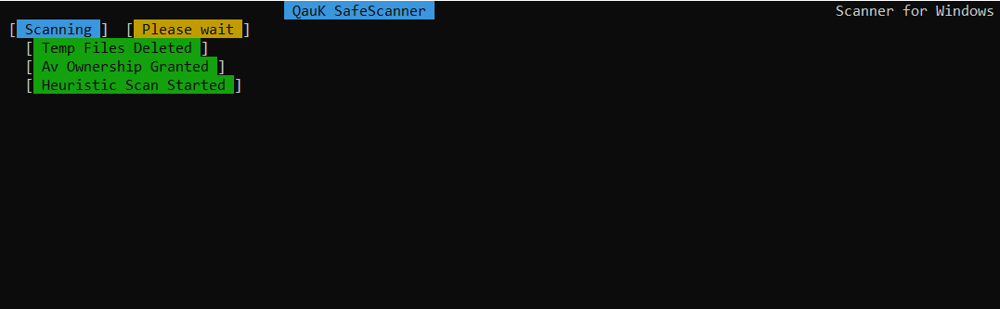

# Onix (Batch Antimalware Protection)

<svg width="260" height="160.33915318592258" viewBox="0 0 260 160.33915318592258" class="css-1j8o68f"><defs id="SvgjsDefs2517"></defs><g id="SvgjsG2518" featurekey="symbolFeature-0" transform="matrix(1.32183908045977,0,0,1.32183908045977,61.36781583983323,-33.31034583606939)" fill="#d6e4f0" data-darkreader-inline-fill="" style="--darkreader-inline-fill:#282b2d;"><path xmlns="http://www.w3.org/2000/svg" d="M52.2,50.8C24,50.8,8.8,44.2,8.8,38S24,25.2,52.2,25.2S95.7,31.8,95.7,38S80.5,50.8,52.2,50.8z M52.2,27.2  c-24.4,0-41.5,5.7-41.5,10.8s17,10.8,41.5,10.8c24.4,0,41.5-5.7,41.5-10.8S76.7,27.2,52.2,27.2z"></path><path xmlns="http://www.w3.org/2000/svg" d="M52.2,62.6C24,62.6,8.8,56,8.8,49.8c0-0.6,0.4-1,1-1s1,0.4,1,1c0,5.1,17,10.8,41.5,10.8c24.4,0,41.5-5.7,41.5-10.8  c0-0.6,0.4-1,1-1s1,0.4,1,1C95.7,56,80.5,62.6,52.2,62.6z"></path><path xmlns="http://www.w3.org/2000/svg" d="M89,44.9c-0.1,0-0.3,0-0.4-0.1C81.1,41.2,67.2,39,52.2,39c-15,0-28.9,2.2-36.3,5.8c-0.5,0.2-1.1,0-1.3-0.5  c-0.2-0.5,0-1.1,0.5-1.3c7.7-3.7,22-6,37.2-6c15.2,0,29.5,2.3,37.2,6c0.5,0.2,0.7,0.8,0.5,1.3C89.7,44.7,89.4,44.9,89,44.9z"></path><path xmlns="http://www.w3.org/2000/svg" d="M9.8,50.7c-0.5,0-0.9-0.4-0.9-0.9V38c0-0.5,0.4-0.9,0.9-0.9s0.9,0.4,0.9,0.9v11.8C10.7,50.3,10.3,50.7,9.8,50.7z"></path><path xmlns="http://www.w3.org/2000/svg" d="M52.2,67.4c-0.6,0-1-0.4-1-1v-4.8c0-0.6,0.4-1,1-1s1,0.4,1,1v4.8C53.2,67,52.8,67.4,52.2,67.4z"></path><path xmlns="http://www.w3.org/2000/svg" d="M52.2,81c-4.2,0-7.6-3.4-7.6-7.6c0-4.2,3.4-7.6,7.6-7.6c4.2,0,7.6,3.4,7.6,7.6C59.8,77.6,56.4,81,52.2,81z M52.2,67.9  c-3.1,0-5.6,2.5-5.6,5.6c0,3.1,2.5,5.6,5.6,5.6c3.1,0,5.6-2.5,5.6-5.6C57.8,70.4,55.3,67.9,52.2,67.9z"></path><path xmlns="http://www.w3.org/2000/svg" d="M54.9,71.1h-5.1c-0.3,0-0.5-0.2-0.5-0.5s0.2-0.5,0.5-0.5h5.1c0.3,0,0.5,0.2,0.5,0.5S55.2,71.1,54.9,71.1z"></path><path xmlns="http://www.w3.org/2000/svg" d="M56.1,74h-7.7c-0.3,0-0.5-0.2-0.5-0.5s0.2-0.5,0.5-0.5h7.7c0.3,0,0.5,0.2,0.5,0.5S56.4,74,56.1,74z"></path><path xmlns="http://www.w3.org/2000/svg" d="M54.9,76.8h-5.1c-0.3,0-0.5-0.2-0.5-0.5s0.2-0.5,0.5-0.5h5.1c0.3,0,0.5,0.2,0.5,0.5S55.2,76.8,54.9,76.8z"></path><path xmlns="http://www.w3.org/2000/svg" d="M94.7,50.8c-0.6,0-1-0.4-1-1V38c0-0.6,0.4-1,1-1s1,0.4,1,1v11.8C95.7,50.3,95.3,50.8,94.7,50.8z"></path><path xmlns="http://www.w3.org/2000/svg" d="M12.6,42.5c-0.3,0-0.5-0.2-0.5-0.5v-4.8c0-0.3,0.2-0.5,0.5-0.5s0.5,0.2,0.5,0.5V42C13.1,42.3,12.9,42.5,12.6,42.5z"></path><path xmlns="http://www.w3.org/2000/svg" d="M14.5,44.1c-0.3,0-0.5-0.2-0.5-0.5V39c0-0.3,0.2-0.5,0.5-0.5S15,38.7,15,39v4.6C15,43.9,14.8,44.1,14.5,44.1z"></path><path xmlns="http://www.w3.org/2000/svg" d="M16.3,44.1c-0.3,0-0.5-0.2-0.5-0.5v-3.2c0-0.3,0.2-0.5,0.5-0.5s0.5,0.2,0.5,0.5v3.2C16.8,43.9,16.5,44.1,16.3,44.1z"></path><path xmlns="http://www.w3.org/2000/svg" d="M91.7,42.5c-0.3,0-0.5-0.2-0.5-0.5v-4.8c0-0.3,0.2-0.5,0.5-0.5s0.5,0.2,0.5,0.5V42C92.2,42.3,92,42.5,91.7,42.5z"></path><path xmlns="http://www.w3.org/2000/svg" d="M89.8,44.1c-0.3,0-0.5-0.2-0.5-0.5V39c0-0.3,0.2-0.5,0.5-0.5s0.5,0.2,0.5,0.5v4.6C90.3,43.9,90.1,44.1,89.8,44.1z"></path><path xmlns="http://www.w3.org/2000/svg" d="M88,44.1c-0.3,0-0.5-0.2-0.5-0.5v-3.2c0-0.3,0.2-0.5,0.5-0.5s0.5,0.2,0.5,0.5v3.2C88.5,43.9,88.3,44.1,88,44.1z"></path></g><g id="SvgjsG2519" featurekey="nameFeature-0" transform="matrix(0.839451856760881,0,0,0.839451856760881,-3.066349411903461,84.42521200650422)" fill="#f6f6f6" data-darkreader-inline-fill="" style="--darkreader-inline-fill:#1d2021;"><path d="M20.352 40 l-8.7695 -11.992 l-2.0703 0 l0 11.992 l-5.8594 0 l0 -28.223 l5.8594 0 l0 11.094 l1.9922 0 l8.8477 -11.094 l7.1484 0 l-10.938 13.496 l11.27 14.727 l-7.4805 0 z M44.003718750000004 11.405999999999999 c5.8398 0 10.371 4.2188 10.371 9.8242 c0 2.207 -0.72266 4.4336 -2.5195 6.875 l-8.7891 11.895 l-6.4063 0 l7.3047 -9.5508 c-0.42969 0.058594 -0.83984 0.078125 -1.2695 0.078125 c-4.7852 0 -9.1211 -3.6328 -9.1406 -9.2773 c-0.039063 -5.7813 4.8438 -9.8438 10.449 -9.8438 z M49.08171875 21.445 c0.058594 -2.9492 -1.8555 -4.9805 -4.9219 -4.9805 c-2.9688 0 -5.0977 2.0117 -5.1172 4.9219 c-0.039063 2.9297 1.9922 5.0586 5.0586 5.0586 c2.9883 0 4.9414 -2.1875 4.9805 -5 z M62.38285 31.9531 l0 -4.707 l14.004 0 l0 4.707 l-14.004 0 z M86.52339375 40 l0 -28.223 l10.215 0 c9.0039 0 13.457 5.6641 13.457 14.102 c0 8.457 -4.4531 14.121 -13.457 14.121 l-10.215 0 z M92.38279375 34.8242 l4.0625 0 c5.1953 0 7.5781 -3.2422 7.5781 -8.9453 s-2.3828 -8.9453 -7.5781 -8.9453 l-4.0625 0 l0 17.891 z M135.6840625 16.934 l-10.469 0 l0 6.4063 l9.2773 0 l0 5.0977 l-9.2773 0 l0 6.3867 l10.469 0 l0 5.1758 l-16.367 0 l0 -28.223 l16.367 0 l0 5.1563 z M161.99221875 16.934 l-10.742 0 l0 6.4063 l9.2773 0 l0 5.0977 l-9.2773 0 l0 11.563 l-5.8984 0 l0 -28.223 l16.641 0 l0 5.1563 z M186.99265625 16.934 l-10.469 0 l0 6.4063 l9.2773 0 l0 5.0977 l-9.2773 0 l0 6.3867 l10.469 0 l0 5.1758 l-16.367 0 l0 -28.223 l16.367 0 l0 5.1563 z M215.9378125 11.777000000000001 l5.8398 0 l0 28.223 l-6.7773 0 l-12.5 -20.176 l0 20.176 l-5.8398 0 l0 -28.223 l6.6992 0 l12.578 20.059 l0 -20.059 z M232.7148 40 l0 -28.223 l10.215 0 c9.0039 0 13.457 5.6641 13.457 14.102 c0 8.457 -4.4531 14.121 -13.457 14.121 l-10.215 0 z M238.5742 34.8242 l4.0625 0 c5.1953 0 7.5781 -3.2422 7.5781 -8.9453 s-2.3828 -8.9453 -7.5781 -8.9453 l-4.0625 0 l0 17.891 z M281.87546875 16.934 l-10.469 0 l0 6.4063 l9.2773 0 l0 5.0977 l-9.2773 0 l0 6.3867 l10.469 0 l0 5.1758 l-16.367 0 l0 -28.223 l16.367 0 l0 5.1563 z M306.445625 40 l-7.3438 -12.422 l-1.6992 0 l0 12.422 l-5.8594 0 l0 -28.223 l10.234 0 c6.3867 0 9.082 3.7695 9.082 8.4375 c0 3.7891 -2.1484 6.25 -5.9766 7.0703 l8.4961 12.715 l-6.9336 0 z M297.402325 16.641 l0 6.7383 l3.457 0 c3.125 0 4.3945 -1.3281 4.3945 -3.3594 c0 -2.0117 -1.2695 -3.3789 -4.3945 -3.3789 l-3.457 0 z"></path></g><g id="SvgjsG2520" featurekey="sloganFeature-0" transform="matrix(1.911828868620292,0,0,1.911828868620292,50.00000011395388,122.10257581351675)" fill="#d6e4f0" data-darkreader-inline-fill="" style="--darkreader-inline-fill:#282b2d;"><path d="M8.36 5.699999999999999 l0.58 0 l0 14.3 l-0.58 0 l0 -13 l-3.56 7.16 l-0.66 0 l-3.56 -7.16 l0 13 l-0.58 0 l0 -14.3 l0.58 0 l3.88 7.8 z M19.6185 20 l-0.56 -2.26 l-5.48 0 l-0.56 2.26 l-0.6 0 l3.54 -14.3 l0.72 0 l3.54 14.3 l-0.6 0 z M13.7185 17.14 l5.2 0 l-2.6 -10.44 z M31.457 5.699999999999999 l-3.56 7.14 l3.56 7.16 l-0.66 0 l-3.22 -6.5 l-3.24 6.5 l-0.64 0 l3.56 -7.16 l-3.56 -7.14 l0.64 0 l3.24 6.48 l3.22 -6.48 l0.66 0 z M40.335499999999996 5.699999999999999 l0.64 0 l-2.7 5.42 l0 8.88 l-0.64 0 l0 -8.88 l-2.7 -5.42 l0.64 0 l2.38 4.76 z M53.07249999999999 10.44 c2.04 0.58 3.52 2.46 3.52 4.68 c0 2.7 -2.18 4.88 -4.88 4.88 l-0.58 0 l0 -14.3 l0.58 0 c1.42 0 2.56 1.14 2.56 2.56 c0 0.92 -0.48 1.72 -1.2 2.18 z M51.71249999999999 6.279999999999999 l0 3.96 c1.1 0 1.98 -0.88 1.98 -1.98 s-0.88 -1.98 -1.98 -1.98 z M51.71249999999999 19.42 c2.38 0 4.3 -1.94 4.3 -4.3 c0 -2.38 -1.92 -4.3 -4.3 -4.3 l0 8.6 l0 0 z M67.01099999999998 6.279999999999999 c-3.62 0 -6.54 2.94 -6.54 6.56 s2.92 6.56 6.54 6.56 s6.58 -2.94 6.58 -6.56 s-2.96 -6.56 -6.58 -6.56 z M67.01099999999998 5.699999999999999 c3.96 0 7.16 3.2 7.16 7.14 s-3.2 7.16 -7.16 7.16 c-3.94 0 -7.14 -3.22 -7.14 -7.16 s3.2 -7.14 7.14 -7.14 z M83.0495 5.699999999999999 l0.64 0 l-2.7 5.42 l0 8.88 l-0.64 0 l0 -8.88 l-2.7 -5.42 l0.64 0 l2.38 4.76 z"></path></g></svg>

It's has some code from anic17 and it has a some bugs but a lot more protection.

____________________________________________________________________________________________________________________________

____________________________________________________________________________________________________________________________
